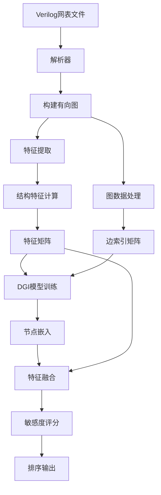
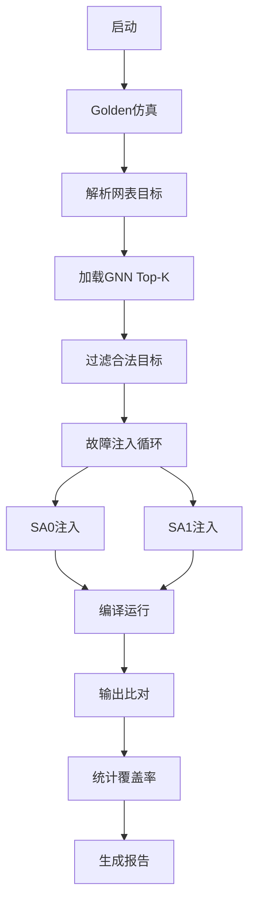

# Fault-Sensitivity-Ranker-for-gate-netlist-test
本项目旨在构建一个故障点智能选取系统（“故障敏感度评分器”）：在不进行显式故障注入的前提下，利用电路网表的结构/拓扑特征与图神经网络（GNN）自监督表征，对每个节点的故障敏感度进行打分与排序（Top-K）。随后仅对高分节点做少量注入仿真进行验证，从而在保证覆盖率可观的同时，显著减少仿真次数与验证成本。该系统面向 DFT/验证/可靠性工程流程，目标是成为“测试向导（test guidance）”——把资源优先投向更可能出问题、对系统行为更关键的节点。

## 为什么要“尽早识别敏感节点”？——具体收益

1.测试与仿真效率大增
* 传统做法是对海量节点做均匀或盲目注入，成本随规模指数级上涨；敏感度排序让我们把80% 的仿真预算投到 20% 的关键节点。

* 更少的 vvp/ATE 向量、缩短 iverilog 编译—运行—比对闭环的总时长。

2.更快的收敛，更少的回归

* 先聚焦高风险节点，可更早发现“致命故障路径”，缩短设计—验证—修复的闭环周期。

* 对回归场景，Top-K 白名单可作为**“冒烟测试”**优先集，使每次提交都有高价值的快速反馈。

3.DFT/ATPG/冗余优化的“放大器”

* 敏感度高的网点往往位于高扇出、强收敛或近时序边界位置，对测试可观测/可控性影响大。

* 排名结果可直接为 ATPG 目标化、观察点/控制点插入、选择性 TMR/ECC/Parity 加固提供量化依据。（Triple Modular Redundancy/Error-Correcting Code/Parity Check）

4.可靠性与可制造性（Yield/Reliability）提升

* 对于软错误（SEU）/老化/变工艺角等场景，优先加固/监测高敏感节点可抑制系统级失效传播，提升稳定性与良率。

* 在安全/车规/航天等场景，有助于满足特定故障覆盖目标与合规性要求。

5.安全分析（Fault Attack Surface）辅助

* 在安全芯片/加密模块中，敏感节点排序有助于定位故障注入攻击的高价值表面，为攻防研究与缓解策略提供依据。


6.调试与 ECO 指导（Engineering Change Order）

* 敏感节点往往是调试“捷径”：日志/探针优先放在这些点上可提升诊断速度。

* ECO 前后对敏感度的变化可量化风险，帮助评估修改对可测性/可观测性的影响。

7.节省硬件/仿真资源成本

* 在算力/许可证受限的环境下（CI、云仿真、共享 farm），Top-K 策略能把同样预算转化为更高覆盖收益。

## 我们如何达成目标（与代码配套）
1. 预测阶段：unsup_sensitivity.py

* 基于 Pyverilog 解析网表，构建“网点+实例”的有向图；

* 提取结构/拓扑特征（度中心性、到输出的距离、近时序边界、重收敛度、深度等）；

* 使用 DGI 自监督方式学习节点嵌入，融合成敏感度分数，输出 gnn_rank.txt（全节点排序）。

* 无需任何故障注入，可作为快速预筛选。

2. 验证阶段：manual_validation.py
* 读取 gnn_rank.txt 的 Top-K 节点，与网表中可注入的合法目标求交集；

* 只对这部分高分节点分别注入 sa0/sa1，与 golden 输出对比，统计节点覆盖率/故障覆盖率；

* 以极少数量的注入，验证“排序是否有效”，为后续 DFT/ATPG/加固决策提供依据。

通过这套“先智能筛选，再小样本验证”的流程，能在不牺牲覆盖目标的前提下，显著压缩验证时间与算力花费，把工程力量集中在对系统行为最关键的网点上。

## 环境配置
为了快速设置，您可以使用以下命令一次性安装所有依赖项：

pip install -r requirements.txt

## 完整系统可以由以下模块组成：

1. Verilog Parser：解析网表为 AST

2. Graph Builder：从 AST 构建图（节点+边）

3. 特征提取器：从节点语义中构建结构语义特征

4. 评分器模型：图神经网络输出故障敏感度打分

5. Top-K 选点：选出前 K 个最可能故障点用于后续验证

## 下面将详细介绍实验的实现环节

## 第一步 配置标准单元库（cells.v我直接给出了，对于不同的网表，详细代码生成可见[fusa.github](https://github.com/baikediguo/fusa/blob/main/generate_cell_code.py) ）

功能：* 自动解析网表中的标准单元实例（例如，DFFX1，NAND2X0）
     * 根据预定义模板为每种单元类型生成行为Verilog模型
     * 保留原始端口顺序以兼容LEC* 处理顺序元件的特殊寄存器输出

## 第二步 testbench 初始化（tb.v）
在数字电路设计（Verilog / VHDL）里，testbench（测试平台/测试夹具） 是专门用来 验证电路设计是否正确的代码，它不是实际要综合进芯片的逻辑，而是一个仿真环境。

Testbench 的作用

1.功能验证 (Functional Verification)
* 给 DUT（Design Under Test，被测设计）提供 输入激励（stimulus）。
* 观察 DUT 的 输出结果，检查是否符合预期。

2.自动化测试
* Testbench 可以写断言 (assertions)、对比参考模型 (golden model) 输出，自动判断 PASS/FAIL。

3. 仿真环境搭建
* 包含时钟 (clock)、复位 (reset)、输入波形、输出采集。
* 加文件读写、日志打印、波形转储 (VCD dump) 方便调试。

4.故障注入 / 验证
* 在容错设计研究中（比如 fault injection），testbench 可以注入 force 信号，模拟翻转、卡死等硬件错误。
  
要求:
* 将cells.v和tb.v放在同一个目录下
* 测试平台（tb.v）必须正确实例化PE模块并映射端口
* 确保存在1ns/1ps时间尺度的指令，以进行正确的定时仿真。

## 第三步 没有显式注入故障的情况下，对 Verilog 电路网表中每个节点的故障可能性进行预测或排序（unsup_sensitivity.py）

#### 1. **初始化与工具模块**
- **功能**：设置随机种子、文件读取、归一化处理等基础工具
- **关键组件**：
  - `set_seed()`: 确保实验可重复性
  - `read_text()`: 安全读取文件内容
  - `safe_norm()`: 向量归一化（防除零错误）
  - `minmax_norm()`: 特征归一化到[0,1]区间
  - `z2u01()`: 将余弦值映射到[0,1]区间

#### 2. **Verilog解析与图构建**
- **功能**：将Verilog网表转换为有向图
- **关键组件**：
  - `parse_verilog_graph()`: 
    - 使用`pyverilog`解析AST
    - **节点类型**:
      - 线网节点(`wire`)：表示电路连线
      - 实例节点(`cell`)：表示逻辑门/寄存器
    - **边方向**:
      - 输入：线网 → 实例
      - 输出：实例 → 线网
    - **特殊标记**:
      - 输出节点(如Q/Z端口)
      - 时序单元(DFF/LATCH等)

#### 3. **结构特征提取**
- **功能**：计算拓扑特征量化节点重要性
- **`compute_struct_features()`提取10维特征**:
  1. 入度/出度
  2. PageRank中心性
  3. 介数中心性(采样加速)
  4. 特征向量中心性
  5. 到输出的最小/平均距离(取倒数)
  6. 重收敛度(2-hop输出重叠)
  7. 近时序单元标志
  8. 节点名长度(弱代理)
  9. 输出节点标志
  10. 深度(受限BFS的最大深度)

#### 4. **图数据构建**
- **功能**：转换为PyG兼容格式
- **`build_pyg_data()`处理流程**:
  1. 节点类型one-hot编码
  2. 拼接12维特征向量：
     - 类型编码 + 10个结构特征 + 输出标志
  3. 构建有向边索引
  4. 保留节点ID与名称映射

#### 5. **自监督学习模型**
- **架构**:
  - **编码器**：3层GIN卷积
    ```python
    GINConv(Linear→ReLU→Linear→ReLU)
    ```
  - **判别器**：DGI对比学习
    - 正样本：原始图嵌入
    - 负样本：特征置换的图
    - 目标：最大化图级摘要与节点嵌入互信息
- **训练**:
  - 150轮Adam优化
  - 损失函数：`-log(σ(pos)) - log(1-σ(neg))`

#### 6. **敏感度融合评分**
- **`fuse_scores()`融合策略**:
  ```python
  score = 0.25*centrality    # (PR+介数+特征向量)/3
         + 0.25*proximity     # 距离倒数(min/avg)
         + 0.20*reconv        # 重收敛度
         + 0.15*near_ff       # 时序边界标志
         + 0.15*embed_sim     # 与输出节点嵌入的余弦相似度
  ```

#### 7. **主控流程**
- **执行步骤**:
  1. 解析命令行参数
  2. Verilog→有向图转换
  3. 提取拓扑特征
  4. 构建PyG数据
  5. DGI自监督训练
  6. 融合特征评分
  7. 输出Top-K敏感节点

### 关键创新点
1. **无监督故障预测**：  
   无需故障注入标签，通过结构特征+图嵌入预测敏感度

2. **特征工程**：  
   融合10种拓扑特征，涵盖：
   - 中心性(全局重要性)
   - 路径特性(接近输出程度)
   - 时序特性(近FF边界)
   - 结构特性(重收敛度)

3. **多模态融合**：  
   ```数学公式
   Score = α·Struct + β·Embed
   ```
   结构特征(可解释) + 图嵌入(上下文感知)

4. **高效性优化**：  
   - 介数中心性采用采样近似
   - 深度计算使用受限BFS
   - 时序单元邻近标志替代全路径分析

### 输出说明
- **结果文件**：`gnn_rank.txt`
  ```text
  net_name 0.8765
  cell_name 0.8123
  ...
  ```
- **排序依据**：得分降序，高分节点更敏感

> 典型高敏感节点特征：位于关键路径、高扇出、近时序边界、重收敛区域、与输出节点嵌入相似度高。

## 系统架构图

    1. 流程示意图：
    ```mermaid
    graph LR
    A[Verilog文件] --> B[AST解析]
    B --> C[识别实例和连线]
    C --> D[构建有向图]
    D --> E[标记输出节点]
    D --> F[标记时序单元]
    ```
   2. 自监督学习(DGI)
   ```mermaid
    graph TD
    A[原始特征] --> B[GIN编码器]
    C[扰动特征] --> B
    B --> D[节点嵌入H]
    B --> E[扰动嵌入H_corrupt]
    D --> F[图级摘要s]
    F --> G[判别器]
    E --> G
    D --> G
    G --> H[损失计算]
    ```

## 第四步 验证敏感节点有效性（manual_validation.py）
这个程序实现了**电路节点敏感度验证系统**，通过故障注入仿真验证 GNN 预测的敏感节点是否真实有效。
#### **1. 配置模块**
```python
# 基本配置
VERILOG_SRC = 'pe.synth_dct.v'   # 网表文件
TB_FILE = 'tb.v'                 # 测试平台文件
CELL_LIB = 'cells.v'             # 工艺库文件
RANK_FILE = 'gnn_rank.txt'       # GNN预测结果
LOGDIR = 'sim_logs_manual'       # 日志目录
TOPK = 1025                      # 验证前K个节点
INJECT_DELAY_CYCLES = 5          # 故障注入延迟周期
MAX_VVP_SECONDS = 60             # 仿真超时时间
OSUM_HEX_RE = re.compile(r'^o_sum=([0-9a-fA-FxzXZ]+)')  # 输出匹配规则
MAX_UNKNOWN_RATIO = 0.2          # 允许的未知值(X/Z)比例
```
**功能**：
- 定义文件路径和关键参数
- 设置故障注入策略（延迟周期、超时时间）
- 指定输出信号解析规则（正则匹配）
- 控制仿真质量（最大未知值比例）

---

#### **2. 核心子程序**

##### **2.1 命令执行工具**
```python
def run_cmd(cmd: List[str], capture=False, timeout=None)
```
**功能**：
- 安全执行 shell 命令
- 支持输出捕获和超时控制
- 处理编码问题（UTF-8/GBK 兼容）

##### **2.2 Verilog 解析工具**
```python
def strip_comments(text: str)
def extract_module(text: str, modname: str)
def split_decl_names(decl_body: str)
def parse_ports(module_text: str)
def parse_internal_nets(module_text: str)
def parse_targets_from_netlist(netlist_text: str, dut_module='pe')
```
**功能**：
- 去除代码注释
- 提取指定模块
- 解析端口声明（input/output/inout）
- 识别内部线网（wire/reg）
- 生成可注入目标集合：`(输出端口 ∪ 内部线网) - 输入端口`

##### **2.3 故障注入生成器**
```python
def make_injected_tb(tb_text: str, target_net: str, stuck: int)
```
**生成代码示例**：
```verilog
initial begin : __fi_block
    wait (reset == 0);
    repeat(5) @(posedge clock);
    force uut.net_name = 1'b0;  // 固定为0
    $display("FAULT_INJECTED: net_name sa0");
end
```
**特点**：
- 自动插入到 testbench
- 复位释放后延迟注入
- 添加注入标记便于日志解析

##### **2.4 仿真流水线**
```python
def compile_and_run(sources, exe_path, vcd_path, log_path, timeout)
```
**工作流程**：
1. 调用 `iverilog` 编译：  
   `iverilog -g2012 cells.v design.v tb_injected.v -o sim.out`
2. 执行 `vvp` 仿真：  
   `vvp sim.out +DUMPFILE=wave.vcd`
3. 日志重定向到文件
4. 超时强制终止

##### **2.5 结果分析器**
```python
def parse_osum_as_ints(logfile: str)
```
**处理逻辑**：
1. 用正则 `o_sum=([0-9a-fA-FxzXZ]+)` 提取输出值
2. 过滤含 X/Z 的未知值
3. 计算未知值比例
4. 返回有效数值列表

##### **2.6 GNN 结果加载器**
```python
def load_gnn_topk(path: str, topk: int)
```
**功能**：
- 读取 `gnn_rank.txt`
- 取前 K 个节点名
- 跳过空行和格式错误行

---

#### **3. 主验证流程** (`main()`)

##### **3.1 Golden 参考仿真**
```python
# 运行无故障仿真
compile_and_run([CELL_LIB, VERILOG_SRC, TB_FILE], ...)
golden_vals, golden_unk = parse_osum_as_ints(golden_log)
```
**目的**：建立输出基准值

##### **3.2 准备注入目标**
```python
legal_targets = set(parse_targets_from_netlist(net_text))
gnn_topk = load_gnn_topk(RANK_FILE, TOPK)
filtered_topk = [n for n in gnn_topk if n in legal_targets]
```
**过滤规则**：
1. 必须是可注入目标（非输入端口）
2. 排除时钟/复位信号（正则匹配）
3. 保留网表存在的节点

##### **3.3 故障注入循环**
```python
for i, net in enumerate(filtered_topk):
    for val in [0, 1]:  # SA0 和 SA1
        # 1. 生成注入版testbench
        tb_inj = make_injected_tb(tb_src, net, val)
        
        # 2. 运行仿真
        compile_and_run([CELL_LIB, VERILOG_SRC, tb_tmp], ...)
        
        # 3. 解析输出
        vals, unk = parse_osum_as_ints(log)
        
        # 4. 结果比对
        diff = sum(1 for a,b in zip(golden_vals, vals) if a != b)
```
**关键处理**：
- 每个节点注入两种故障（SA0/SA1）
- 忽略高未知值比例的无效仿真
- 采样长度对齐（取 min(len_golden, len_fault)）

##### **3.4 覆盖率统计**
```python
# 节点覆盖率
node_cov = detected_nodes / len(filtered_topk) * 100

# 故障覆盖率
fault_cov = per_fault_detect / (len(filtered_topk)*2) * 100
```
**指标**：
- **节点覆盖率**：至少被检测到一次故障的节点比例
- **故障覆盖率**：所有注入故障中被检测到的比例

---

### **系统工作流**


### **创新设计亮点**

1. **智能目标过滤**：
   - 自动区分可注入/不可注入节点
   - 排除时钟复位等无效目标
   ```python
   if n not in legal_targets or re.match(r'^(clk|rst)', n)
   ```

2. **未知值容错**：
   ```python
   if unk > MAX_UNKNOWN_RATIO:  # 跳过低质量仿真
   ```

3. **增量式进度反馈**：
   ```python
   if i%20==0: 
       print(f"进度{i}/{total} 节点覆盖率={detected_nodes/i:.1%}")
   ```

4. **故障注入标准化**：
   - 统一注入延迟（等待复位释放）
   - 自动添加故障标记
   ```verilog
   $display("FAULT_INJECTED: net_name sa0");
   ```

5. **双维度覆盖率**：
   - 节点级（Node Coverage）
   - 故障级（Fault Coverage）

### **典型输出报告**
```
=== manual_validation.py starting ===
运行 golden 仿真（基准）...
✅ golden 样本 512，unknown_ratio=0.00%
🎯 验证节点数: 1025（示例前20）: [net1, net2, ...]
进度 20/1025 — 节点累计检测=18/20，fault累计检测=33/40
...
进度 1025/1025 — 节点累计检测=892/1025，fault累计检测=1683/2050

—— 统计 ——
节点总数(验证): 1025
检测到的节点数: 892
节点覆盖率:     87.02%
故障总数(节点*2): 2050
检测到的故障数: 1683
故障覆盖率:     82.10%
⏱ 总耗时: 215.3s
```

### **技术挑战解决方案**

1. **网表解析问题**：
   - 使用正则+语法分析组合解析
   - 处理复杂声明 `wire [7:0] a,b,c;`

2. **仿真不稳定性**：
   - 设置超时终止
   - 未知值比例过滤
   ```python
   MAX_UNKNOWN_RATIO = 0.2  # >20% X/Z则丢弃
   ```

3. **信号匹配难题**：
   - 统一输出格式规范
   ```verilog
   $display("o_sum=%h", value);  // 强制格式
   ```

4. **大规模仿真优化**：
   - 并行空间设计（每个仿真独立目录）
   - 进度分批反馈

该系统为GNN预测提供了可靠的物理验证，通过自动化故障注入将算法预测与实际电路行为关联，形成完整的AI-EDA验证闭环。


## 第五步：为了进一步验证以上程序的准确性，我又进行了先故障注入后提取特征的算法，即使用AI在显式注入故障的情况下，对 Verilog 电路网表中每个节点的故障可能性进行预测或排序（gatesa_fault_injection）
1. 系统由三个核心模块组成

* 故障注入程序 (gatesa_fault_injection.py 或类似)	往 Verilog 节点强制注入故障（force），运行 Icarus Verilog 仿真，生成节点的敏感性检测结果	日志文件 (sim_logs/...) 或 CSV
* GNN 模型预测程序 (verilog_fault_ranker.py 或 GNN 训练/推理脚本)	根据 Verilog 网表结构特征，预测每个节点的故障敏感度分数，输出排序文件	gnn_rank.txt
* manual_validation.py	选取指定节点（如 GNN 排名前 K），再次注入故障，运行真实仿真验证敏感度，计算检测率
* 验证统计仍然使用 manual_validation_detail.py

2. 执行顺序（不改程序的前提下）

1️⃣ 运行故障注入程序

* 目的是生成真实的节点敏感性标签（可以用来训练 GNN）

* 输出文件：sim_logs/ 中的原始故障覆盖率数据

这是你构建训练集的“黄金标准”

2️⃣ 运行 GNN 模型预测程序

* 输入：Verilog 网表（结构特征）+（可选）步骤 1 生成的训练标签

* 输出：gnn_rank.txt（预测分数和排名）

3️⃣ 运行 manual_validation.py

* 输入：gnn_rank.txt

* 功能：在真实仿真环境下验证 GNN 排名前 K 节点的敏感度

* 输出：覆盖率、详细日志、Spearman 相关性等指标


3. 数据流示意图

  Verilog 网表
      │
      ▼
┌─────────────┐
│ 故障注入程序 │───> 真实标签集 (sim_logs)
└─────────────┘
      │
      ▼
┌──────────────┐
│  GNN预测程序 │───> gnn_rank.txt
└──────────────┘
      │
      ▼
┌─────────────────┐
│ manual_validation│───> 覆盖率统计 / 相关性评估
└─────────────────┘


## 第六步 模型构建程序 verilog_fault_ranker.py(GNN预测程序) 
1.提供一个基于 PyVerilog → NetworkX → PyTorch Geometric (GINConv) 的端到端流程：
* 解析 Verilog 网表 → 构图与特征工程 → 用少量标签做节点级回归训练 → 输出全网表节点的敏感度排名
* 输出：gnn_rank.txt（每行 节点名 分数，按分数从高到低排序）
  
2. 研究动机 / Objective
* 在大规模数字设计中，尽早识别“故障敏感”节点能显著降低验证与量产风险：
* 测试向量选取更高效：把时间和成本集中在高风险节点，减少无效仿真。
* DFT/DFD 优化：为插入扫描链、监测点、冗余设计提供依据。
* 良率与可制造性提升：优先优化易传播/易暴露故障的关键路径与扇出热点。
* 根因定位更精准：对线上/量产问题能更快缩小怀疑范围，缩短 debug 周期。

相比“全图枚举 + 大规模故障注入”的传统流程，本方法可直接从网表结构出发（辅以少量“分数标签”），在不大量注入故障的前提下对所有节点进行评分，给出 Top-K 的候选敏感点，为后续的精准注入与验证提供“智能预筛”。

3.解析网表并构图（parse_verilog_graph）

* 节点两类：wire/net（type='wire'）

* 实例 instance（type=单元名，如 NAND2X1、DFFX1）

* 有向边：输入 net → 实例 → 输出 net

* 通过常见端口名集合 {Z, ZN, Q, QN, OUT, Y, o_sum} 判断“输出口”，据此决定边方向，并记录“输出 net 集合”。

* 特征工程（build_pyg_data）

* 类型 one-hot：按 type（单元名/wire）做独热编码。

4. 结构/拓扑特征（节点级）：

* fanin（入度）、fanout（出度）

* is_output（是否 PO or 汇点）

* depth（从该点可达节点最短路最大深度，近似层级）

* 到所有输出节点的最短路最小值/均值（未连通则 0，做了简单缩放）

## 第七步 验证 （仍然使用相的验证程序manual_validation.py）
