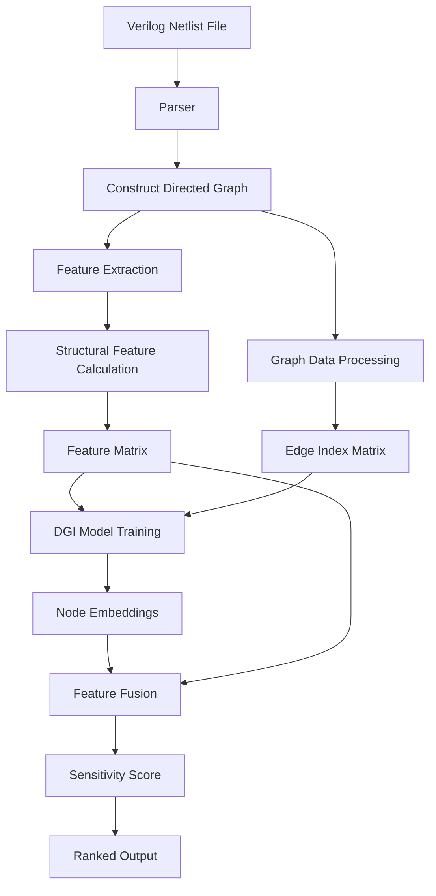
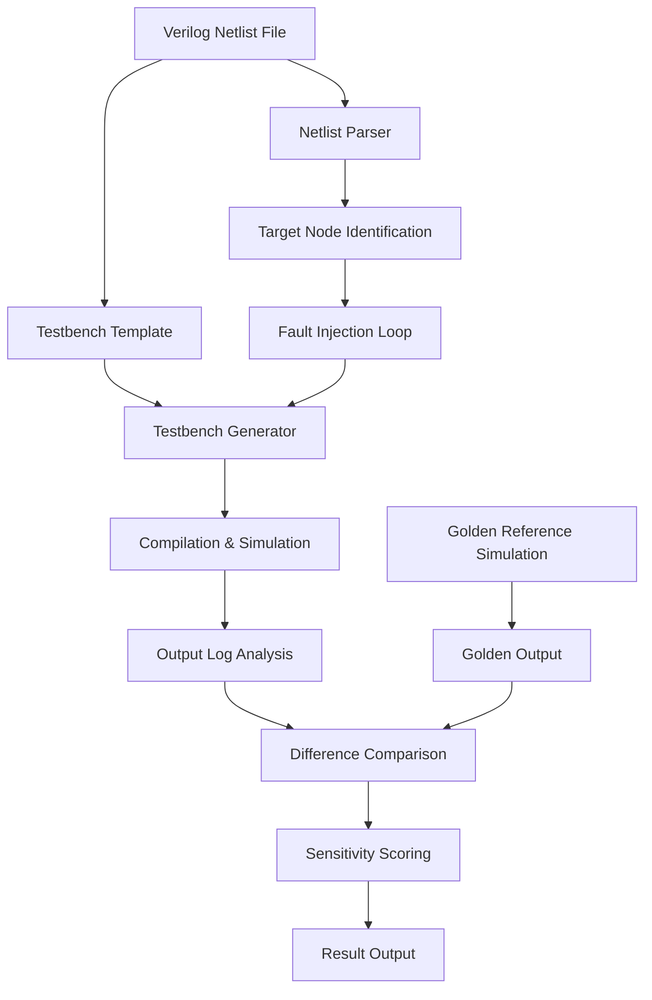
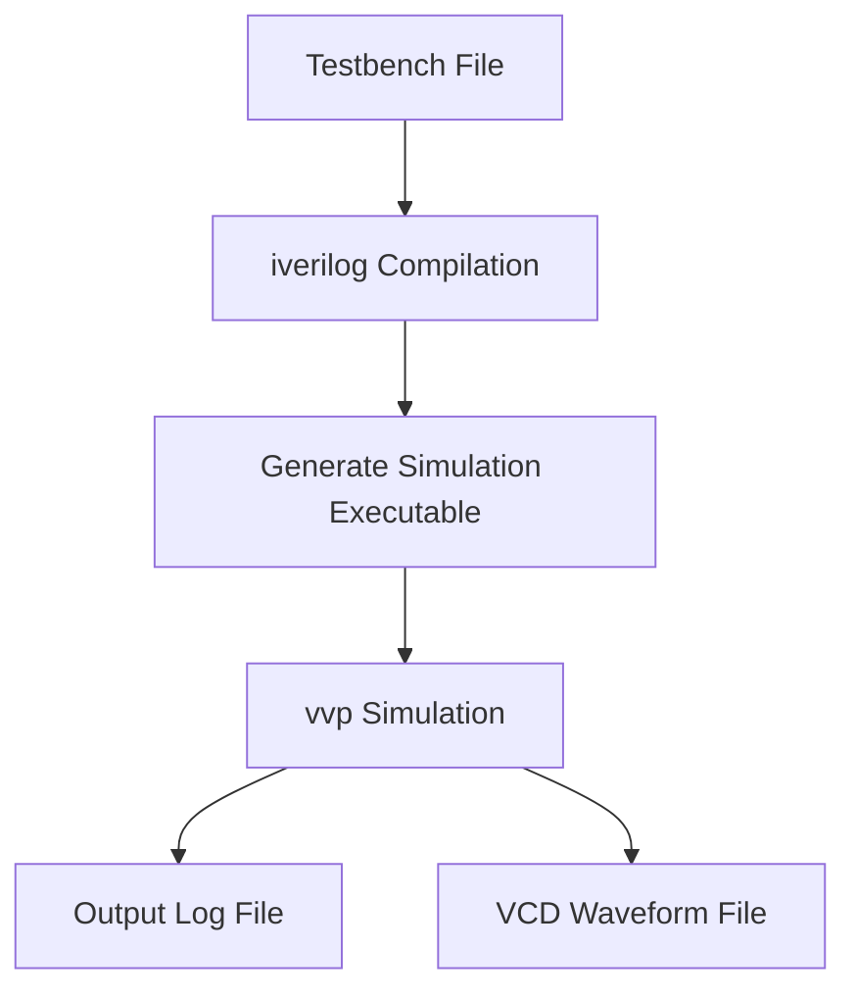
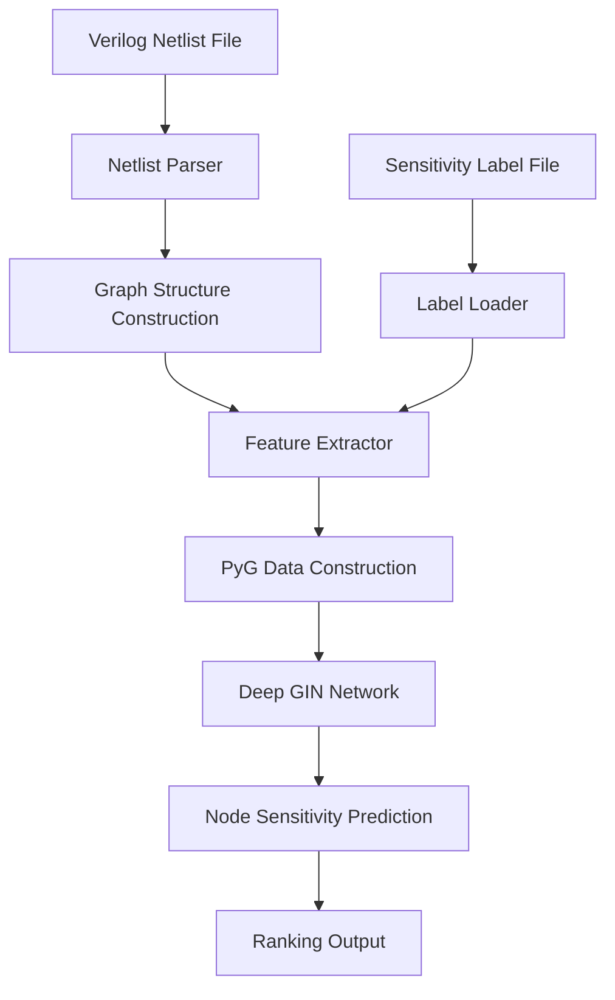
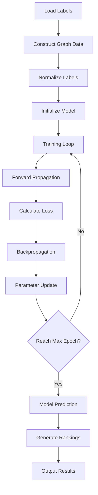

## Project Title: Fault-Sensitivity-Ranker-for-gate-netlist-test

[English](README_en.md) | [中文说明](README.md)

This is English readme...

## Objective
Uses AI (particularly graph neural networks) to predict or rank the likelihood of faults at each node in a Verilog circuit netlist without explicitly injecting faults.

## Motivation
1. Testing and simulation efficiency increased.
* The traditional approach involves evenly or fully injecting into a large number of nodes, with costs increasing exponentially with scale.
* Fewer VVP/ATE vectors, reducing the total time for the Iverilog compile-run-compare loop.

2. Faster convergence, fewer regressions
* Focus on high-risk nodes to detect 'fatal fault paths' earlier, thereby shortening the design-validation-repair closed-loop cycle.

3. DFT/ATPG/redundancy optimization of 'amplifier'

* High-sensitivity nodes are often located at high fan-out, strong convergence, or near timing boundary positions, significantly affecting test observability and controllability.。
* The ranking results can directly provide quantitative basis for ATPG targetization, insertion of observation/control points, and selective TMR/ECC/parity hardening.（Triple Modular Redundancy/Error-Correcting Code/Parity Check）

4. Reliability and manufacturability（Yield/Reliability）improve

* For scenarios involving soft errors (SEUs)/aging/process corner variations, prioritizing reinforcement and monitoring of high-sensitivity nodes can suppress the propagation of system-level failures, enhancing stability and yield.
* In scenarios such as safety, automotive regulations, and aerospace, it helps meet specific fault coverage goals and compliance requirements.

5. Safety analysis (Fault Attack Surface) assistance

* In secure chips/encryption modules, sorting sensitive nodes helps identify high-value surfaces for fault injection attacks, providing a basis for offensive and defensive research as well as mitigation strategies.

6. Debugging and ECO guidance（Engineering Change Order）

* Sensitive nodes are often shortcuts for debugging: placing logs/probes at these points can improve diagnostic speed.

* The change in sensitivity before and after ECO can quantify risks, helping to evaluate the impact of modifications on testability/observability.

7. Save hardware/simulation resource costs

* In environments with limited computing power or licenses (such as CI, cloud simulation, shared farms), the Top-K strategy can convert the same budget into higher coverage benefits.

## Fault injection using Pyverilog in a single PE

[Pyverilog](https://github.com/PyHDI/Pyverilog) can parse the Verilog netlists into Abstract Syntax Trees (ASTs) and generate verilog code from ASTs. ASTs can be modified to inject faults.

Golden Simulation:
* Compile and run the gate-level model 
* Outputs golden simulation results in `sim_logs/sim_logs_manual`

Fault Injection:
* Model: single stuck-at fault
* `gatesa_fault_injection.py` traverses all gates (such as AND/OR/XOR...) and performs 'fault injection' on each gate—such as forcing the output to 0 (stuck-at-0) or 1 (stuck-at-1). Injects faults into all gate output ports, regardless of whether they are wires or registers, by inserting an assign statement to achieve 'generalized node-level' injection, ensuring no output nodes are skipped. This indirectly covers all Q-end registers and wire nodes.
* For each fault version, generate a modified Verilog file, call Icarus Verilog (iverilog) to run functional simulation, and extract the output.

Evaluation:
* `unsup_sensitivity.py` Predicting or ranking the likelihood of faults at each node in a Verilog circuit netlist without explicit fault injection.
* `manual_validation.py` Verify through fault injection simulation whether the sensitive nodes predicted by GNN are truly effective.

##  Environment Setup Notes
For a quick setup, you can use the following command to install all dependencies at once:

pip install -r requirements.txt

Alternatively, if you prefer to install the dependencies step-by-step, please follow the instructions below:
* [Pyverilog](https://github.com/PyHDI/Pyverilog): `pip install pyverilog`
* [iVerilog](https://steveicarus.github.io/iverilog/)
* On Windows: Use [mingw-w64](https://www.mingw-w64.org) or [WSL](https://learn.microsoft.com/en-us/windows/wsl/install)
* Technology libraries need to be downloaded separately (Optional):
  * Synopsys Educational Design Kit (SAED90nm)
  * [Nangate Open Cell Library](https://github.com/JulianKemmerer/Drexel-ECEC575/tree/master/Encounter/NangateOpenCellLibrary)
 
## Below is a detailed guide for the experimental process, broken down into 5 steps to provide clear instructions： 

## Step 1: Configure standard cell library (I directly provided it; for different Netlist, detailed code generation can be seen [fusa.github](https://github.com/baikediguo/fusa/blob/main/generate_cell_code.py) ）)

   Script: generate_cell.code.py
   Input: Synthesized netlist file pe.synth_dct.v
   Output: Verilog cell library cells.v
   
   Functionality:
    * Automatically parses standard cell instances (e.g., DFFX1, NAND2X0) from the netlist
    * Generates behavioral Verilog models for each cell type based on predefined templates
    * Preserves original port ordering for LEC compatibility
    * Handles special register outputs for sequential elements

 ## Step 2: Testbench Initialization （tb.v）
   Requirements:
   * Place cells.v and tb.v in the same directory
   * Testbench (tb.v) must instantiate the PE module with correct port mappings
   * Ensure timescale 1ns/1ps directive exists for proper timing simulation
     
 ## Step 3: Predict or rank the fault likelihood of each node in the Verilog circuit netlist without explicit fault injection (unsup_sensitivity.py)
 ## System architecture diagram

    1. Process Flowchart：
```mermaid
    graph LR
    A[Verilog File] --> B[AST Parsing]
    B --> C[Identify Instances & Connections]
    C --> D[Construct Directed Graph]
    D --> E[Mark Output Nodes]
    D --> F[Mark Sequential Elements]
 ```
   2. Self-Supervised Learning (DGI)
```mermaid
    graph TD
    A[Raw Features] --> B[GIN Encoder]
    C[Corrupted Features] --> B
    B --> D[Node Embeddings H]
    B --> E[Corrupted Embeddings H_corrupt]
    D --> F[Graph Summary s]
    F --> G[Discriminator]
    E --> G
    D --> G
    G --> H[Loss Calculation]
 ```
## Step 4 Verify the validity of sensitive nodes（manual_validation.py）
This program verifies the effectiveness of the sensitive nodes predicted by GNN through fault injection simulation.
### **Workflow**
```mermaid
graph TD
    A[Start] --> B[Golden Simulation]
    B --> C[Parse Netlist Targets]
    C --> D[Load GNN Top-K]
    D --> E[Filter Valid Targets]
    E --> F[Fault Injection Loop]
    F --> F1[SA0 Injection]
    F --> F2[SA1 Injection]
    F1 --> G[Compile & Run]
    F2 --> G
    G --> H[Output Comparison]
    H --> I[Calculate Coverage]
    I --> J[Generate Report]
```

## Step 5：To further verify the accuracy of the above program, I conducted an algorithm that first injects faults and then extracts features. This means using AI to predict or rank the likelihood of faults at each node in the Verilog circuit netlist under explicitly injected fault conditions.（gatesa_fault_injection）

1. The system consists of three core modules and one validation module.

 * Fault Injection Program (gatesa_fault_injection.py or similar): Injects faults by forcing values onto Verilog nodes, runs simulations using Icarus Verilog, and generates results for node sensitivity detection.
 * Output: Log files (sim_logs/...) or CSV files.
 * GNN Model Prediction Program (verilog_fault_ranker.py or GNN training/inference script): Predicts a fault sensitivity score for each node based on the structural features of the Verilog netlist and outputs a ranked list.
 * Output: gnn_rank.txt
 * manual_validation.py: Selects specific nodes (e.g., the top-K nodes from the GNN ranking) for fault injection, runs simulations to validate their sensitivity, and calculates the detection rate.
 * Validation statistics are still generated using manual_validation_detail.py.
   
2. System Architecture Diagram

3. Diagram of the Netlist parsing process

   ```mermaid
graph LR
    A[Netlist File] --> B[Remove Comments]
    B --> C[Extract Target Module]
    C --> D[Parse Port Directions]
    C --> E[Parse Internal Nodes]
    D --> F[Identify Output Ports]
    E --> G[Identify Internal Nodes]
    F --> H[Target Node Set]
    G --> H
    H --> I[Filter Valid Nodes]
```
4. Compilation and Simulation Flow

## Step 6 Model build (verilog_fault_ranker.py) 

1 system architecture diagram

2. Netlist Parsing Flowchart
  ```mermaid
graph LR
    A[Verilog File] --> B[AST Parsing]
    B --> C[Identify Instances and Nets]
    C --> D[Construct Directed Graph]
    D --> E[Mark Output Nodes]
```
3. GIN Network Architecture Diagram
   ```mermaid
graph TD
    A[Input Features] --> B[GIN Convolutional Layer 1]
    B --> C[Batch Normalization]
    C --> D[ReLU Activation]
    D --> E[Dropout]
    E --> F[GIN Convolutional Layer 2]
    F --> G[Batch Normalization]
    G --> H[ReLU Activation]
    H --> I[Dropout]
    I --> J[Residual Connection]
    J --> K[GIN Convolutional Layer 3]
    K --> L[...]
    L --> M[GIN Convolutional Layer N]
    M --> N[Linear Output Layer]
    N --> O[Prediction Scores]
```
4. Training and Prediction Flowchart

## Step 7 validate （Still using the verification procedure from step four----manual_validation.py）
